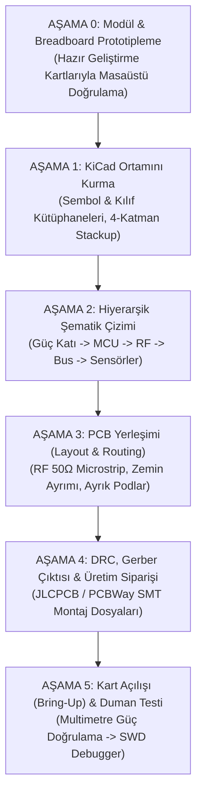

# EKSTREM KOŞUL AYRIK GNSS TERMİNALİ: DONANIM & DEVRE TASARIM REÇETESİ
**Doküman Kodu:** HW-RECIPE-001  
**Revizyon:** 1.0 (Adım Adım Devre Tasarım ve Üretim Kılavuzu)  
**Hedef:** Sıfırdan KiCad ile Üretime Hazır 2 Fiziksel Kart (Göğüs HMI Podu + Çanta RF/Ana İşlemci Podu)

---

## 1. NE İSTİYORUZ? (MİMARİ BÖLÜNME & HEDEF KARTLAR)

İnsan dokusunun RF dalgalarını (1.5 GHz GNSS, 868 MHz LoRa) 20 dB zayıflatmasını engellemek ve -20°C'de donan pillerin göğüste taşınmasını önlemek için sistemi **2 bağımsız PCB** olarak tasarlıyoruz:

```
+---------------------------------------------------------------------------------------------------+
| 1. GÖĞÜS HMI PODU (Chest HMI Pod - Küçük, Hafif, Eldivenle Kullanılan Arayüz Kartı)               |
|    - Ekran: 2.7" Sharp Memory LCD (LS027B7DH01A, 400x240, transflektif, ultra düşük güç)         |
|    - Tuşlar: 4 adet eldiven uyumlu taktik buton (Up, Down, Enter, Back / Chord FSM)              |
|    - Sensörler: Bosch BMP390 (Barometrik irtifa/düşüş) + ST LSM6DSOX (6-eksen IMU)               |
|    - Companion MCU: STM32G0B1CEU6 (UFQFPN-48, 512KB Flash, 144KB RAM, FDCAN destekli)            |
|    - Bus: TI TCAN337G (3.3V CAN-FD Transceiver) + 120 Ohm terminasyon                             |
+---------------------------------------------------------------------------------------------------+
                                         ▲
                                         │  4-Damarlı PUR Korumalı Kablo (1.2 metre)
                                         │  [12V VBUS, GND, CAN_H, CAN_L]
                                         ▼
+---------------------------------------------------------------------------------------------------+
| 2. ÇANTA RF & GÜÇ PODU (Backpack RF & Power Node - Yüksek Güç, Hassas RF ve Hesaplama Kartı)     |
|    - Ana MCU: STM32U575CIT6 (Cortex-M33, 160 MHz, 2MB Flash, 786KB RAM, TrustZone, FDCAN)        |
|    - GNSS: Quectel LC29H(DA) veya TBS M10Q (L1/L5 Çift Frekans, RTK/DR kabiliyetli)              |
|    - LoRa RF: Semtech SX1262 (868 MHz, +22 dBm PA, dahili TCXO)                                  |
|    - Uydu Modem Soketi: RockBLOCK 9603 Iridium SBD (Header bağlantısı)                            |
|    - Güç Katı: TI TPS63020 (Buck-Boost 3.3V Dijital) + TI TPS7A2030 (Ultra-High PSRR RF LDO)     |
|    - Tamponlama: 2x 5F / 2.7V seri Süperkapasitör (ESR çökme koruması)                            |
|    - Koruma/Watchdog: TI TPL5010 (Harici Nano-Power Watchdog) + NTC Batarya Isı Takibi             |
+---------------------------------------------------------------------------------------------------+
```

---

## 2. NELER LAZIM? (BOM - MALZEME LİSTESİ & PARÇA SEÇİMLERİ)

Tüm parçalar **LCSC**, **DigiKey** veya **Mouser** üzerinde stokta bulunan, lehimlenebilir SMD paketlerden seçilmiştir:

### A. Aktif Yarı İletkenler & Entegreler
| Referans | Parça Kodu (MPN) | Kılıf / Paket | Fonksiyon ve Seçilme Nedeni |
| :--- | :--- | :--- | :--- |
| **U1 (Main)** | `STM32U575CIT6` | LQFP-48 / QFP | Çanta MCU: 160MHz Cortex-M33, 2MB Flash (DEM/Topografik harita için), 2x FDCAN. |
| **U2 (Companion)**| `STM32G0B1CEU6` | QFP-48 / QFN-48 | Göğüs MCU: Düşük güç tüketimi, dahili FDCAN kontrolcü. |
| **U3, U4** | `TCAN337GDCNT` | SOT-23-8 | 3.3V CAN-FD Alıcı-Verici (5 Mbps, ±14V bara koruması). |
| **U5 (Buck-Boost)**| `TPS63020DSJR` | VSON-14 (3x4mm) | Batarya voltajı (3.0V - 4.2V) arasında sabit 3.3V VDD_DIG üretir (%96 verim). |
| **U6 (RF LDO)** | `TPS7A2030PDBVR` | SOT-23-5 | GNSS ve LoRa LNA beslemesi (95dB PSRR @ 1kHz, 6.9uV gürültü). |
| **U7 (LoRa)** | `SX1262IMLTRT` | QFN-24 (4x4mm) | 868MHz +22dBm LoRa Transceiver (veya Ebyte E22-900M22S hazır modül). |
| **U8 (Baro)** | `BMP390` | LGA-10 | ±0.03 hPa hassasiyet (~25cm dikey çözünürlük, buzul yarığı düşüş tespiti). |
| **U9 (IMU)** | `LSM6DSOXTR` | LGA-14 | 6-eksen ivmeölçer/jiroskop (serbest düşüş ve darbe şoku tespiti). |
| **U10 (Watchdog)**| `TPL5010DDCR` | SOT-23-6 | 35 nA ultra düşük güç harici donanımsal zamanlayıcı / reset kontrolcü. |

### B. Pasifler, RF ve Koruma Bileşenleri
| Parça | Değer / Özellik | Neden Gerekli? |
| :--- | :--- | :--- |
| **Süperkapasitör** | `2x 5.0F / 2.7V` (Seri = 2.5F / 5.4V) | -20°C'de batarya ESR'si 900mΩ'a fırladığında LoRa 500mA akım çekerken voltajın çökmesini engeller. |
| **RF Ferrit Boncuk**| `Murata BLM18HE152SN1D` (0603) | Buck regülatör gürültüsünü RF LDO'dan önce 18 dB bastıran Pi-filtre bobini. |
| **CAN Choke** | `TDK ACM2012-900-2P` | CAN diferansiyel hatlarında ortak mod gürültüsünü süzen bobin. |
| **ESD/TVS Diyotlar**| `NXP PESD2CAN` (SOT-23) | CAN_H ve CAN_L hatlarını 30 kV elektrostatik deşarja karşı korur. |
| **Ekran Konnektörü**| 10-Pin FPC Konnektör (0.5mm pitch) | Sharp LS027B7DH01A Memory LCD şerit kablo bağlantısı. |
| **Ara Kablo Konnektörü**| `M8 4-Pin Metal Su Geçirmez (IP68)` | Göğüs podu ile çanta arasındaki endüstriyel kilitli kablo soketi. |

---

## 3. ADIM ADIM YOL HARİTASI (NASIL BİR YOL İZLEMELİYİM?)

Hiç PCB çizmemiş bir mühendis olarak izlemen gereken en güvenli, para ve zaman kaybettirmeyen sıralama şudur:



---

### AŞAMA 0: MASAÜSTÜ PROTOTİPLEME (SIFIR RİSK)
Özel PCB çizmeden önce devrenin bloklarını hazır breakout modülleriyle doğrula:
1. **Ekran Doğrulama:** 1 adet Sharp Memory LCD breakout (Adafruit 2.7" veya benzeri) alıp STM32 Nucleo veya ESP32'ye bağla; geliştirdiğimiz [`src/mip_display.c`](file:///c:/Users/ayibogan996/Desktop/projeler/gps/src/mip_display.c) sürücüsünü SPI ile sür.
2. **LoRa Doğrulama:** 2 adet Ebyte E22-900M22S (SX1262) modülüyle 16-baytlık BFT paketlerini masada kablosuz konuştur.
3. **CAN-FD Doğrulama:** İki MCU arasına 1 metre kablo çekip TCAN337 modülleriyle [`src/split_node_bus.c`](file:///c:/Users/ayibogan996/Desktop/projeler/gps/src/split_node_bus.c) paketlerini 1 Mbps'de hatasız akıt.

---

### AŞAMA 1: KİCAD KURULUMU & PROJE YAPISI
1. **KiCad 8 veya 9 Kurulumu:** Resmi sitesinden indir (ücretsiz, açık kaynak).
2. **İki Ayrı Proje Aç:**
   - `chest_hmi_node.kicad_pro` (Göğüs Kartı)
   - `backpack_rf_node.kicad_pro` (Çanta Kartı)
3. **JLCPCB / LCSC Kütüphane Entegrasyonu:**
   - KiCad Eklenti Yöneticisi'nden (Plugin Manager) **"Fabrication Toolkit"** ve **"KiBuzzard"** kur.
   - Bu eklenti tek tıkla üretim için Gerber, BOM (Malzeme Listesi) ve CPL (Pick and Place / Dizgi) dosyalarını otomatik üretir.

---

### AŞAMA 2: ŞEMATİK ÇİZİM KURALLARI (BLOK BLOK)

Şematiği çizerken şu 5 altın kuralı uygula:

#### 1. Güç Katı (Power Supply)
- Bataryadan gelen hatta ters kutup koruması için P-kanallı MOSFET (`SI2301CDS`) koy.
- Buck regülatör (`TPS63020`) indüktörünü seçerken üreticinin önerdiği korumalı (shielded) ferrit bobini kullan (ör: `Coilcraft XFL4020-222MEB`, 2.2 µH).
- Buck çıkışı ile RF LDO (`TPS7A2030`) arasına **Pi-filtre** yerleştir:
  `[C_out (10uF)] ---> [BLM18HE152SN1D Ferrit Boncuk] ---> [C_in (10uF)] ---> [LDO]`

#### 2. Mikrodenetleyici (MCU) Çevresi
- Her `VDD` pini için tam yanına **100 nF X7R 0402/0603** seramik dekuplaj kapasitörü koy.
- `NRST` bacağına 100 nF kapasitör ve 10 kΩ pull-up ekle.
- SWD programlama için 4 pinli 2.54mm veya 1.27mm Cortex-Debug header (`3V3, SWDIO, SWCLK, GND`) koy.

#### 3. CAN-FD Veriyolu Katı
- `CAN_H` ve `CAN_L` arasına tam **120 Ω (%1 toleranslı)** hat sonlandırma direnci ekle (Göğüs kartında ve Çanta kartında birer adet).
- Hat çıkışlarına `PESD2CAN` TVS diyotunu GND'ye bağlayarak yerleştir.

#### 4. RF Katı (LoRa & GNSS)
- Eğer SX1262 ve LC29H'yi çip seviyesinde lehimlemek gözünü korkutuyorsa:
  - **Pratik Çözüm:** Ebyte'ın hazır sertifikalı `E22-900M22S` SMD modülünü şematiğe component olarak ekle. İçinde TCXO, RF anahtarı ve filtreleri hazır gelir, lehimlemesi çok daha kolaydır.
- Anten konnektörleri için standart **SMA Dişi** veya **U.FL (IPEX)** soket kullan.

---

### AŞAMA 3: PCB YERLEŞİMİ (LAYOUT & ROUTING) KURALLARI

Bir PCB'nin çalışıp çalışmamasını layout belirler. Aşağıdaki kurallara harfiyen uy:

#### 1. 4-Katmanlı Stackup Kullanımı (JLC2313 veya Standart FR4)
2 katmanlı kartlarda RF ve yüksek hızlı diferansiyel sinyal geçirmek gürültü felaketidir. 4 katman şarttır:
- **Katman 1 (Top Layer - Sinyal & RF):** Kritik bileşenler, RF microstrip hatları, diferansiyel CAN çiftleri.
- **Katman 2 (Inner 1 - Kesintisiz GND Düzlemi):** %100 deliksiz toprak katmanı. RF sinyallerinin referans düzlemi burasıdır!
- **Katman 3 (Inner 2 - Güç Düzlemleri):** 3.3V VDD_DIG ve 3.0V VDD_RF güç poligonları.
- **Katman 4 (Bottom Layer - Sinyal & Tuşlar):** Düşük hızlı sinyal yolları, butonlar, konnektörler.

#### 2. RF İletim Hattı (50 Ohm Kontrollü Empedans)
- Anten soketine giden iz tam **50 Ω karakteristik empedansa** sahip olmalıdır.
- KiCad içinde dahili `PCB Calculator` aracını aç:
  - Standart 4-katman JLC FR4 için (Top-GND arası dielektrik kalınlığı $H \approx 0.1\text{ mm}$, $\varepsilon_r \approx 4.5$):
  - 50 Ω hat genişliği yaklaşık **$W \approx 0.18 - 0.20\text{ mm}$** çıkar.
- RF hattının her iki yanına 0.4 mm aralıkla GND bakırı dök ve 1 mm aralıklarla GND via'ları (Via Stitching) diz!

#### 3. Gürültü İzolasyonu
- **Buck regülatör katını** kartın bir köşesine topla. Anahtarlama indüktörünün altına hiçbir sinyal izi geçirme.
- **GNSS anten hattını** MCU kristallerinden, CAN hatlarından ve ekran sinyallerinden en az 5 mm uzakta tut.

---

## 4. İLK SİPARİŞ & BRING-UP (ÇALIŞTIRMA) KONTROL LİSTESİ

PCB'ler eline ulaştığında yapacağın adımlar:

1. **Gözle Muayene (Büyüteç/Mikroskop):** Kısa devre veya köprü lehim var mı?
2. **Soğuk Direnç Ölçümü (Multimetre Beep Testi):**
   - Kartta enerji yokken `VBUS` ile `GND` arasını ölç (Kısa devre OLMAMALI).
   - `3.3V DIG` ile `GND` arasını ölç (Kısa devre OLMAMALI).
   - `3.0V RF` ile `GND` arasını ölç (Kısa devre OLMAMALI).
3. **İlk Enerji Verme (Laboratuvar Güç Kaynağı):**
   - Güç kaynağını akım sınırlı **(100 mA limit)** 3.7V veya 12V'a ayarla.
   - Multimetreyle regülatör çıkışlarının tam 3.3V ve 3.0V verdiğini teyit et.
4. **SWD Bağlantısı:**
   - ST-Link v2 / v3 veya J-Link debugger'ı SWD header'ına tak.
   - `STM32CubeProgrammer` aç -> "Connect" de. MCU Core ID göründüğü an işlem tamamdır!
5. **Firmware Yükleme:**
   - Repodaki static kütüphaneleri derleyip test firmware'ini flaşla.

---

Bu kılavuz, projeyi soyut bir fikirden alıp fiziksel dağ koşullarında donmayan, parazit üretmeyen ve kilitlenmeyen askeri seviyede bir cihaza dönüştürmek için ihtiyacın olan tüm mühendislik parametrelerini sunar.
