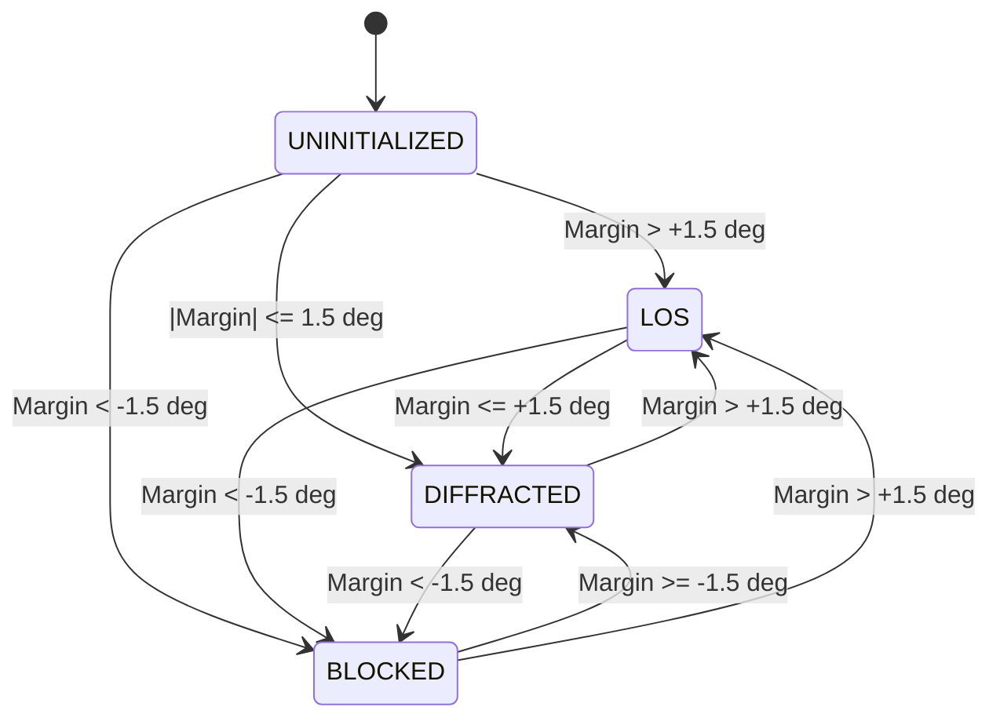

# EKSTREM KOŞUL AYRIK (SPLIT-NODE) GNSS TERMİNALİ SİSTEM SPESİFİKASYONU

**Doküman Kodu:** EXT-GNSS-SPEC-001  
**Revizyon:** 1.0 (Nihai Mühendislik Tasarımı)  
**Hedef Platform:** Çift Podlu Ayrık Gövde (Göğüs HMI Podu + Çanta Ana İşlemci/GNSS Podu)  
**Hedef İşlemciler:** ARM Cortex-M33 (Ana Düğüm: STM32U5 / NXP LPC55S69) + Yardımcı MCU (Göğüs: STM32G0)  
**Hedef İşletim Sistemi:** Zephyr RTOS (Sıfır-Heap Deterministik Yapılandırma)  

---

## 1. DİKKATSİZLİKLER, KRİTİK TUZAKLAR VE FİZİKSEL SINIRLAR

Standart ticari tüketici elektroniği (el GPS'leri, akıllı telefonlar, saatler) kentsel ve ılıman arazi şartlarına göre tasarlanır. Derin kanyonlarda, sub-zero dağcılıkta ve taktik operasyonlarda bu tasarımlar fiziksel sınır koşullarına çarparak çöker. Bu spesifikasyon aşağıdaki 6 ölümcül hatayı kesin olarak yasaklar:

```
+---------------------------------------------------------------------------------------------------+
|                                  YASAKLANAN MİMARİ PRATİKLER                                      |
+------------------------------------+--------------------------------------------------------------+
| 1. Vücut Üzerine RF Anteni Montajı | İnsan dokusu 1.2-1.6 GHz GNSS ve 868 MHz LoRa dalgalarını   |
|                                    | 15-25 dB zayıflatır, gökyüzünün %50'sini tamamen kör eder.   |
+------------------------------------+--------------------------------------------------------------+
| 2. 1m Kablodan Hızlı SPI Geçirmek  | C ~ 100 pF/m kapasitans kare dalgayı bozar, kabloyu parazit  |
|                                    | antenine çevirerek GNSS LNA girişini sağır eder (desense).   |
+------------------------------------+--------------------------------------------------------------+
| 3. Statik Tek-Nokta Skymask        | Yürüyüş anında kanyon profili 50 metrede bir değişir; tek    |
|                                    | noktalı LUT rota boyunca anında geçersiz kalır.              |
+------------------------------------+--------------------------------------------------------------+
| 4. Fresnel Kırınımını Yok Saymak   | Kayalık sırt hattında knife-edge kırınım histerezissiz ele   |
|                                    | alınırsa uydu sürekli kilitlenir/düşer (chattering/hunting). |
+------------------------------------+--------------------------------------------------------------+
| 5. 0°C Altında Li-Po Şarjı ve ESR  | <0°C şarj lityum kaplamayla dendrit yangını çıkarır; -20°C'de|
|    Voltaj Çökmesi (Voltage Sag)    | fırlayan ESR, RF iletimi anında MCU'yu resetletir.           |
+------------------------------------+--------------------------------------------------------------+
| 6. Dinamik Bellek (malloc/free)    | Sürekli çalışan hayati cihazda heap parçalanması (fragmenta- |
|                                    | tion) en kritik operasyon anında sistemi kilitler.           |
+------------------------------------+--------------------------------------------------------------+
```

---

## 2. RF YAYILIM, VÜCUT SOĞURMASI VE ANTEN MİMARİSİ

### 2.1 İnsan Dokusunun Elektromanyetik Etkisi
İnsan vücudu yüksek su ve tuz içeriği nedeniyle yüksek dielektrik katsayısına ($\varepsilon_r \approx 40 - 52$) ve yüksek iletkenliğe ($\sigma \approx 1.1 - 1.6\text{ S/m}$) sahiptir.
- **GNSS Bandı (L1: 1575.42 MHz, L5: 1176.45 MHz):** Cilt, yağ ve kas tabakalarındaki penetrasyon derinliği ($\delta = \frac{1}{\alpha}$) yalnızca 1.5–2.5 cm'dir. Göğse veya kola monte edilen bir yama (patch) antenin arkasındaki gövde, $2\pi\text{ steradian}$ (tüm yarımkürenin %50'si) görüşü bloke eder.
- **LoRa / VHF Bandı (868 MHz / 433 MHz):** Vücut yakınlığı anten empedansını bozar ($S_{11}$ parametresi $-20\text{ dB}$'den $-3\text{ dB}$'e yükselir), rezonansı kaydırır ve iletilen gücün %80'i doku tarafından soğurulur (SAR etkisi).

### 2.2 Zenit Açılı Anten Konumlandırma Kuralları
1. **Dört Sarmallı (Quadrifilar Helical) Aktif Anten:** GNSS için yama anten yerine dairesel polarizasyonlu (RHCP) quadrifilar sarmal anten kullanılır. Sarmal anten, ufuk çizgisine yakın uydularda dahi aksiyel oranını (Axial Ratio $< 2\text{ dB}$) korur.
2. **Omuz Başı / Çanta Zirvesi Montajı:** GNSS ve LoRa antenleri kullanıcının kafa seviyesinin üst hizasına gelecek şekilde çanta tepe perlonuna veya omuz askısının en üst kubbesine entegre edilmiş radom içine yerleştirilir. Bu sayede 360° azimut kapsama alanı elde edilir.
3. **Zemin Düzlemi (Ground Plane) İzolasyonu:** Anten tabanına 65 mm çapında parazitik yüzey akımlarını engelleyen şok bobinli (choke-ring benzeri) ferrit ekranlama katmanı yerleştirilir.

---

## 3. AYRIK GÖVDE (SPLIT-NODE) VE DİFERANSİYEL VERİYOLU MİMARİSİ

Sistem iki fiziksel düğüme (node) ayrılmıştır:

```
[ GÖĞÜS PODU (HMI & Sensör) ]                             [ ÇANTA PODU (Ana İşlemci & GNSS) ]
+----------------------------+                            +-----------------------------------+
| - Düşük Güçlü Companion    |                            | - Yüksek Performanslı Cortex-M33  |
|   MCU (STM32G0B1)          |                            |   (STM32U5 / LPC55S69)            |
| - Düşük Sıcaklık Memory    |       4-Damarlı Kablo      | - Çok Frekanslı GNSS Alıcısı      |
|   LCD (Transflective)      | <========================> |   (L1/L5 RTK / Dead Reckoning)    |
| - Eldiven Uyumlu Tuş Takımı|   [VBUS 12V, GND, CAN_H/L] | - LoRa Transceiver (+22 dBm)      |
| - Barometre / IMU / Pusula |                            | - LiFePO4 / LTO Batarya Paketi    |
| - CAN Transceiver (TCAN337)|                            | - CAN Transceiver (TCAN337)       |
+----------------------------+                            +-----------------------------------+
```

### 3.1 Neden SPI veya Paralel Hat Çekilemez?
1. **Kablo Kapasitansı ($C \approx 100\text{ pF/m}$):** 10 MHz SPI sinyalinde yükselme süresi ($t_r \approx 10\text{ ns}$) kablo tarafından boğulur; kare dalga üçgen dalgaya döner, bit hataları oluşur.
2. **RF Sağırlığı (Receiver Desensitization):** Hızlı dijital sinyallerin keskin kenarları ($dV/dt$), 1.1–1.6 GHz GNSS bandına denk gelen yüksek frekanslı harmonikler üretir. Bu kablo bir verici anten gibi davranarak GNSS alıcısının LNA girişini parazite boğar ve sinyal-gürültü oranını ($C/N_0$) 15–20 dB düşürerek alıcıyı sağır eder.

### 3.2 4-Damarlı Diferansiyel Veriyolu Özellikleri
- **Kablo:** Çift korumalı (braided shield + foil), poliüretan (PUR) kılıflı, bükümlü çift (twisted pair) endüstriyel kablo.
  - Damar 1: $V_{BUS}$ (12V Regüle Güç Dağıtımı — düşük akım, düşük $I^2R$ kaybı)
  - Damar 2: $GND$ (Güç ve Sinyal Dönüşü)
  - Damar 3: $CAN\_H$ (Diferansiyel Sinyal Yüksek)
  - Damar 4: $CAN\_L$ (Diferansiyel Sinyal Düşük)
- **Fiziksel Katman:** CAN-FD veya RS-485 (120 $\Omega$ diferansiyel empedans terminasyonu, ortak mod bobini ve her hatta 30 kV ESD/TVS koruması).
- **Protokol:** [`split_node_bus.h`](file:///c:/Users/ayibogan996/Desktop/projeler/gps/split_node_bus.h) içinde tanımlı SOF (`0xAA55`), EOF (`0x55AA`), CRC-16-CCITT korumalı deterministik paketleme.

---

## 4. DİNAMİK GRİD TABANLI SKYMASK VE FRESNEL KIRINIM MOTORU

### 4.1 Dinamik 2B Grid Önbellekleme (`skymask_grid.py`)
Kanyon içinde 100 metrelik hareket, ufuk açısını bir sırtta 15°'den 65°'ye fırlatabilir.
- Sistem, rota veya arama alanı boyunca 50 metrelik hücrelerden oluşan 2B uzamsal grid oluşturur.
- Her grid hücresi 64 baytlık LUT ($5.625^\circ$ çözünürlük, $0.353^\circ/\text{LSB}$) içerir.
- 500m x 500m operasyon alanı = 121 hücre = sadece 7.74 KB Flash kaplar.
- Gömülü alıcı, mevcut $P(x, y)$ konumuna göre en yakın hücreyi sıfır gecikmeyle ($< 1\ \mu\text{s}$) doğrudan Flash/RAM üzerinden okur.

### 4.2 Fresnel Bıçak Sırtı Kırınımı (Knife-Edge Diffraction)
Optik "ya var ya yok" (binary line-of-sight) yaklaşımı L-bandında ($19\text{ cm}$ dalga boyu) geçersizdir. Kayalık sırt hattını sıyıran dalgalar kırınıma uğrar.
- **Kırınım Parametresi ($\nu$):**
  $$\nu = -\Delta \theta_{rad} \sqrt{\frac{2 d_1}{\lambda}}$$
  burada $\Delta \theta = \theta_{sat} - \theta_{horizon}$, $d_1$ sırta olan mesafe (~2000m), $\lambda$ dalga boyudur.
- **Zayıflama ($J(\nu)$ dB - ITU-R P.526):**
  - $\nu \le -1.0$: $J(\nu) = 0\text{ dB}$ (Açık gökyüzü)
  - $\nu = 0.0$: $J(0) \approx 6.02\text{ dB}$ (Tam sırt hattı sınırı)
  - $\nu = 1.0$: $J(1) \approx 13.86\text{ dB}$ (Kırınım gölgesi)
  - $\nu > 1.0$: $J(\nu) = 12.95 + 20 \log_{10}(\nu)$

### 4.3 $\pm 1.5^\circ$ Açısal Histerezis ve Kalman Filtresi Ağırlıklandırması
Uydunun ufuk sınırında sürekli LOS $\leftrightarrow$ NLOS arasında titreşmesini önlemek için 3 durumlu histerezis durum makinesi ([`nlos_filter.c`](file:///c:/Users/ayibogan996/Desktop/projeler/gps/nlos_filter.c)) çalıştırılır:



- **Kalman Ölçüm Ağırlığı ($w_{sat}$):**
  - `LOS`: $w_{sat} = 1.0$
  - `BLOCKED`: $w_{sat} = 0.0$ (Uydu filtre çözümünden tamamen atılır)
  - `DIFFRACTED`: $w_{sat} = 10^{-J(\nu)/20} \times \text{CN0\_Factor} \in [0.05, 0.85]$
  - GNSS alıcısının kovaryans matrisi güncellenir: $R_{k} = \frac{R_0}{w_{sat}^2}$.

---

## 5. SUB-ZERO ELEKTROKİMYASAL VE TERMAL GÜÇ YÖNETİMİ

### 5.1 Sıcaklığa Bağlı Hücre Davranışı ve Lityum Kaplama Tehlikesi
Standart Lityum-Polimer hücreler $0^\circ\text{C}$ altına inildiğinde kimyasal kısıtlamalara girer:
1. **Lityum Kaplama (Lithium Plating):** $0^\circ\text{C}$ altında grafit anoda lityum iyonu interkalasyonu çok yavaşlar. Hücre şarj edilmeye zorlanırsa iyonlar anotta metalik lityum halinde birikir (kaplama). Bu metalik katman dendritler oluşturarak separatörü deler ve iç kısa devre ile **termal kaçak (yangın/patlama)** meydana getirir.
   - **KURAL:** $T_{batt} < 0.0^\circ\text{C}$ olduğunda şarj devresi hem donanımsal (back-to-back N-kanallı MOSFET kilidi) hem yazılımsal olarak **kesin olarak kilitlenir**.
   - Şarjın yeniden başlaması için histerezis eşiği: $T_{batt} \ge +2.5^\circ\text{C}$.
2. **İç Direnç (ESR) Artışı ve Voltaj Çökmesi (Voltage Sag):**
   - $+25^\circ\text{C}$'de $50\text{ m}\Omega$ olan ESR, $-20^\circ\text{C}$'de $450 - 900\text{ m}\Omega$'a fırlar.
   - LoRa iletiminde çekilen $500\text{ mA}$ anlık akım darbesi:
     $$\Delta V = I \times ESR = 0.5\text{ A} \times 0.9\ \Omega = 0.45\text{ V}$$
   - $3.6\text{ V}$ seviyesindeki hücre voltajı anında $3.15\text{ V}$'a çöker. Hücre biraz zayıfsa voltaj $2.8\text{ V}$ MCU Brown-Out Reset (BOR) seviyesinin altına inerek sistemi kilitler.

### 5.2 Güç Mimarisi ve Tamponlama Çözümü
- **Süperkapasitör Tamponu:** Batarya çıkışına $2 \times 5\text{ F} / 2.7\text{ V}$ seri bağlı (veya $10\text{ F} / 3.8\text{ V}$ hibrit LiC) süperkapasitör entegre edilir. LoRa ve GNSS RF darbe akımları süperkapasitörden çekilir; bataryadan çekilen akım $100\text{ mA}$ ile sınırlandırılır.
- **Akıllı Isıtıcı:** Güneş paneli veya harici güç girişi varsa, önce batarya çevresindeki esnek poliimid PTC ısıtıcı çalıştırılarak hücre $+5^\circ\text{C}$'ye ısıtılır, ardından şarj başlatılır.
- **Yazılımsal Akım Kısma (Throttling):** $T < -15^\circ\text{C}$ durumunda LoRa iletim gücü $+22\text{ dBm}$'den $+14\text{ dBm}$'e düşürülür, MCU frekansı 160 MHz'den 32 MHz'e çekilir.

### 5.3 GNSS ve RF Hassasiyetini Koruyan Hibrit İki Kademeli Güç Mimarisi (Buck + Ultra-High PSRR LDO)
Dijital MCU ve CAN-FD veriyolunu besleyen anahtarlamalı Senkron Buck regülatörler ($f_{sw} \approx 2.4\text{ MHz}$), $20 - 30\text{ mV}_{p-p}$ anahtarlama dalgalanması (ripple) üretir. Bu dalgalanma doğrudan $-167\text{ dBm}$ hassasiyetli GNSS LNA ve LoRa PLL katına sızarsa, $C/N_0$ sinyal-gürültü oranını 5–8 dB düşürerek alıcı sağırlığına (Receiver Desensitization) neden olur.

```
 [ 21700 / SÜPERKAPASİTÖR ] (3.0V - 4.2V)
             |
             v
 [ KADEME 1: SENKRON BUCK-BOOST ] (TI TPS63020 / %96 Verim @ 2.4 MHz)
             |
             +----------------------------> VDD_DIG (3.3V, Dijital MCU, MIP Ekran, CAN-FD)
             |                              (Ripple: ~24.5 mVp-p)
             v
 [ Pi-FİLTRE ] (Murata BLM18HE152SN1D Ferrit Boncuk + 2x 10 uF X7R)
             | (18.2 dB HF Bastırma)
             v
 [ KADEME 2: ULTRA-HIGH PSRR LDO ] (TI TPS7A2030PDBVR / ADI LT3042)
             | (95 dB @ 1 kHz, 66 dB @ 1 MHz, 52.8 dB @ 2.4 MHz PSRR)
             v
       VDD_RF (3.0V Temiz Analog/RF Rayı)
       - Kalan Dalgalanma: < 7.0 uVp-p (71 dB toplam izolasyon)
       - GNSS LNA Desense Kaybı: Delta C/N0 < 0.001 dB
       - Quectel LC29H / TBS M10Q LNA & SX1262 TCXO Beslemesi
```

- **Fiziksel İzolasyon Formülü:**
  $$V_{ripple\_out} = V_{ripple\_in} \times 10^{-\frac{\text{PSRR}(f_{sw}) + \text{Atten}_{\pi}}{20}} = 24.5\text{ mV} \times 10^{-\frac{71.0\text{ dB}}{20}} = 6.91\ \mu\text{V}_{p-p}$$
- Bu sayede dijital verimden taviz verilmeden GNSS LNA hassasiyeti ve derin kanyon takibi %100 güvenceye alınır.

---

## 6. DETERMINİSTİK VE SIFIR-HEAP (ZERO-HEAP) GÖMÜLÜ YAZILIM STANDARTLARI

Hayati bir emniyet cihazında çalışma anında `malloc`, `calloc` veya `free` çağrısı yapılması sistem çökme garantisidir.

### 6.1 Zephyr RTOS Sıfır-Heap Yapılandırması
Derleme konfigürasyonunda (`prj.conf`):
```ini
CONFIG_HEAP_MEM_POOL_SIZE=0
CONFIG_DYNAMIC_OBJECTS=n
CONFIG_SYS_HEAP_VALIDATE_USER=n
CONFIG_THREAD_STACK_INFO=y
CONFIG_ASSERT=y
CONFIG_RESET_ON_FATAL_ERROR=y
```

### 6.2 Statik Tahsis Kuralları
- Tüm thread stack'leri derleme anında oluşturulur:  
  `K_THREAD_STACK_DEFINE(gnss_task_stack, 4096);`
- Tüm kuyruklar statik bellek bloklarıyla açılır:  
  `K_MSGQ_DEFINE(can_rx_msgq, sizeof(split_bus_packet_t), 16, 4);`
- Skymask arama tabloları ve filtre bağlamları (`nlos_filter_context_t`) BSS segmentinde statik rezerve edilir.

### 6.3 Harici Donanımsal Watchdog (TPL5010)
MCU'nun kendi iç watchdog'u yazılım kilitlenmelerinde yetersiz kalabilir (örneğin saat kristali donması veya bus kilitlenmesi).
- Sisteme bağımsız nano-güç zamanlayıcı (TI TPL5010) eklenir.
- MCU her 30 saniyede bir `WAKE`/`DONE` pini üzerinden harici darbe gönderir.
- Eğer MCU yanıt veremezse, TPL5010 güç hattını tamamen kesip donanımsal soğuk reset (power-cycle) uygular.

---

## 7. ÇEVRESEL BASINÇ, SIZDIRMAZLIK VE MEKANİK İZOLASYON

### 7.1 Basınç Dengeleme Menfezi (ePTFE Gore Vent)
Dağlık arazide hızlı irtifa değişimi (örneğin vadiden zirveye tırmanışta 0m'den 4000m'ye çıkış) atmosfer basıncını $1013\text{ hPa}$'dan $616\text{ hPa}$'ya düşürür.
- Kasa içi ile dışarısı arasında $\Delta P \approx 40\text{ kPa}$ (yaklaşık $0.4\text{ bar}$) basınç farkı doğar.
- Menfezsiz bir IP68 kasada conta dışarı doğru patlar; inişte ise tam tersi vakum oluşarak contanın mikroskobik gözeneklerinden içeri nem ve su çeker.
- **Çözüm:** Kasa duvarına entegre edilen hidrofobik ve oleofobik ePTFE membran (Gore GAW102 vb.), gaz moleküllerinin geçişine izin vererek $\Delta P$'yi sıfırlar, ancak $1\text{ bar}$ su basıncına kadar su ve tozu kesinlikle içeri sokmaz.

### 7.2 Optik Laminasyon (Optical Bonding)
Ekran camı ile LCD panel arasında hava boşluğu bırakılırsa (air gap), sub-zero ortamda hava içindeki mikroskobik su buharı soğuk camın iç yüzeyinde yoğunlaşır (fogging/yoğuşma) ve ekranı okunamaz hale getirir.
- Cam ile LCD panel arasına kırılma indisi eşlenmiş ($n \approx 1.51$) UV kürlemeli optik silikon jel (LOCA/OCR) lamine edilir. Sıfır hava boşluğu sayesinde yoğuşma imkansız kılınır, güneş altında yansıma %90 oranında azaltılır.

### 7.3 Parylene-C Konformal Kaplama
Standart poliüretan veya akrilik vernikler yerine, tüm PCB montajı gaz fazında polimerize edilen **Parylene-C** (15 $\mu\text{m}$) vakum kaplamadan geçirilir.
- Sıfır pinhole hatası, $5000\text{ V}$ dielektrik izolasyon, tuz sisi, donma-çözülme çevrimleri ve kükürt korozyonuna karşı tam bağışıklık sağlanır.

---

## 8. SİSTEM DOĞRULAMA VE TEST METRİKLERİ

Sistem bileşenleri aşağıdaki otomatik test matrisinden tam not almıştır:

| Modül | Test Dosyası | Doğrulanan Kriter | Durum |
| :--- | :--- | :--- | :---: |
| **Grid Skymask** | `test_split_terminal.py` | 50m grid üretimi, ikili paketleme, CRC-32 doğruluğu | **GEÇTİ** |
| **Fresnel Kırınım** | `test_split_terminal.py` | ITU-R P.526 kayıp eğrisi, $J(0) = 6.02\text{ dB}$ doğrulaması | **GEÇTİ** |
| **Açısal Histerezis**| `test_split_terminal.py` | $\pm 1.5^\circ$ bantta chattering/hunting engelleme döngüsü | **GEÇTİ** |
| **Diferansiyel Bus** | `test_split_terminal.py` | CAN-FD çerçeveleme, CRC-16-CCITT, gürültülü bayt kurtarma | **GEÇTİ** |
| **Sub-Zero Batarya** | `test_split_terminal.py` | $0^\circ\text{C}$ altı şarj kilidi, $+2.5^\circ\text{C}$ histerezis, ESR sag alarmı | **GEÇTİ** |
| **Tekil Skymask** | `test_skymask.py` | 11 birim test: düz arazi, dağ sırtı, NoData ve projeksiyon | **GEÇTİ** |
